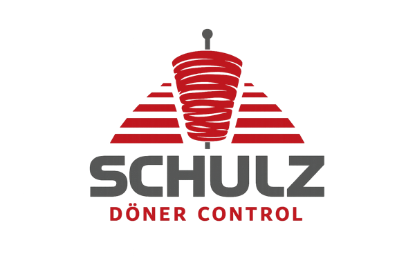

<p align="center">
  
</p>

<h1 align="center">Schulz Döner Control</h1>

<p align="center">
  <strong>„Ich will heute Döner!"</strong><br>
  Die offizielle Kommandozentrale für den <em>Döner-Tag</em> im Schulz-Büro. 🌯
</p>

<p align="center">
  
  
  
  
  
</p>

---

## Worum geht's, Chef?

Jeden Donnerstag dasselbe Ritual: Das halbe Büro will einen **Drehspieß-Tasche**, einer
fährt zum Laden, **einer zahlt die ganze Rechnung**, und danach beginnt die ewige Suche
nach dem Zettel und die Frage aller Fragen — *„Wie war nochmal dein PayPal-Link?"*

**Schulz Döner Control** macht Schluss damit. Die App organisiert den kompletten Ablauf:

1. **Döner-Tag eröffnen** — irgendwer ruft den Tag aus, alle anderen klinken sich ein.
2. **Bestellung abgeben** — Menü wählen, konfigurieren, fertig. Mit **Bestellschluss**.
3. **Abholer benennen** — wer fährt, zahlt vor und kassiert wieder ein.
4. **PayPal-Abrechnung** — alle bekommen einen vorbefüllten **PayPal.Me**-Link mit ihrem
   Betrag. Offene Zahlungen werden mitgeführt, bis Ruhe im Karton ist.

Internes, mit Absicht albernes Werkzeug — gebaut auf dem todernsten Schulz
**Machine-Eye**-Designsystem. Alles auf **Deutsch**, alles spricht dich mit **„Chef"** an.

> 📖 Die volle Produkt- & Designspezifikation (Menü, Döner-Tiere, Farbwerte, Flow) steht
> in **[CONTEXT.md](CONTEXT.md)**.

---

## Was die App kann

- 🥙 **Döner-Tag** — eröffnen, einchecken, bestellen, mit Bestellschluss-Uhrzeit.
- 🛒 **Bestellung konfigurieren** — Fleisch (Kalb / Hähnchen), Soßen (Kräuter 🌿,
  Knoblauch 🧄, Scharf 🌶), Pizza-Varianten, Extrawünsche und Preis pro Position.
- 🚗 **Abholer** — ein oder mehrere Kollegen melden sich als heutige Fahrer.
- 💸 **PayPal-Abrechnung** — vorbefüllte PayPal.Me-Links pro Person, offene Zahlungen
  im Blick.
- 🦨 **Döner-Tiere** — jeder bekommt ein Tier, berechnet aus der echten Bestellhistorie
  der letzten 3 Monate. 15 Stück, von der *Bürowaffe* bis zum *soliden Döner-Bürger*.
- 🏆 **Bestenliste** — wer hat in diesem Büro die meisten Drehspieße verputzt?
- 🔔 **Döner-Synonyme** — Push-Nachrichten, die den Döner niemals beim Namen nennen
  (*Osmanischer Fleischeimer*, *Drehmoment-Mäppchen*, *Anatolische Fleischbombe* …).
- 🛠️ **Admin-Bereich** — Benutzer, Menü und Döner-Tiere verwalten.
- 🖨️ **Druckansicht** — die Bestellliste ausdrucken und dem Laden-Personal in die Hand
  drücken.

### Die Döner-Tiere (Auszug)

Dein Tier wird aus deinem Bestellverhalten errechnet — das erste passende gewinnt:

| Tier | Wann du es bekommst |
|------|---------------------|
| 🦨 Die Bürowaffe | Viel Knoblauch **und** viel Scharf |
| 🐺 Der Knoblauch-Wolf | Knoblauch in fast jeder Bestellung |
| 🐉 Der Schärfe-Drache | Scharf, immer scharf |
| 🍕 Der Pizza-Verräter | Du bestellst Pizza beim *Döner*-Laden |
| 🐭 Die Trockenmaus | Döner, aber konsequent ohne Soße |
| 🌯 Der solide Döner-Bürger | Du machst einfach alles richtig (Fallback) |

→ Alle 15 Tiere mit Auslöser-Logik und Taglines: **[CONTEXT.md](CONTEXT.md#döner-tier)**.

---

## Tech-Stack

| | |
|---|---|
| **Backend** (`server/`) | C# / **.NET 9**, Clean Architecture, **FastEndpoints**, EF Core + **SQLite**, JWT im httpOnly-Cookie + CSRF, Argon2id. Tests: xUnit v3 (echte SQLite-DB). |
| **Frontend** (`web/`) | **React 19** + TypeScript, **MUI v9**, **TanStack** Router & Query, Zod, React Hook Form, Vite, Biome, Vitest + MSW. Paketmanager: **pnpm**. |
| **Design** | Schulz **Machine-Eye** — Open Sans, Schulz-Rot `#C90023`, Navy `#002230`, die diagonale *Schräge*. Keine KI-Schlonz-Verläufe. |

---

## Loslegen, Chef

### Voraussetzungen

- **.NET 9 SDK** (`9.0.100`+)
- **Node.js ≥ 22** und **pnpm** (`corepack enable` reicht)

### 1. Backend (API) starten

```bash
cd server
dotnet run --project src/Schulz.DoenerControl.Api
```

Läuft dann auf **http://localhost:5176**. Beim ersten Start legt die App ihre SQLite-DB
(`doenercontrol.db`) an und sät **genau einen Admin**.

### 2. Frontend starten

```bash
cd web
pnpm install
cp .env.example .env.local   # VITE_API_BASE=http://localhost:5176 eintragen
pnpm dev
```

Läuft dann auf **http://localhost:5173**.

### 3. Einloggen

| | Dev-Wert |
|---|---|
| Benutzer | `admin` |
| Passwort | `Admin-Start!2026` |

Beim ersten Login musst du das Passwort ändern — danach landest du im Büro. Weitere
Kollegen legst du im **Admin-Bereich** an; jeder bekommt ein einmaliges Start-Passwort.

> ⚠️ **In Produktion** muss `Auth__AdminSeed__Password` als Umgebungsvariable gesetzt
> werden — sonst verweigert der Seeder absichtlich den Start. Kein unsicherer Default.

---

## Projektstruktur

```
schulz-doener-control/
├─ server/                                  # C# / .NET 9 — Clean Architecture
│  ├─ src/
│  │  ├─ Schulz.DoenerControl.Core           # Domäne: Entities, Enums, Result<T>
│  │  ├─ Schulz.DoenerControl.Application    # Use Cases & Abstraktionen
│  │  ├─ Schulz.DoenerControl.Infrastructure # EF Core, Persistenz, Security
│  │  └─ Schulz.DoenerControl.Api            # FastEndpoints, Composition Root
│  └─ tests/Schulz.DoenerControl.Api.Tests   # Echte-SQLite-Integrationstests
├─ web/                                      # React 19 + TypeScript
│  └─ src/
│     ├─ features/   # auth · home · order · profile · admin · print · tiere · push · success
│     ├─ routes/     # dateibasiertes TanStack-Router-Verzeichnis
│     ├─ lib/        # apiClient & geteilte Bausteine
│     └─ styles/     # Machine-Eye-Theme
├─ mocks/            # HTML-Designmock — die visuelle Quelle der Wahrheit
├─ CONTEXT.md        # Produkt- & Designspezifikation (das Warum & Was)
├─ CLAUDE.md         # Minimale Grundregeln für die Mitarbeit
└─ PLAN.md           # Build-Vertrag (Feature für Feature)
```

---

## Tests & Qualität

**Frontend**

```bash
cd web
pnpm test       # Vitest
pnpm lint       # Biome
pnpm build      # tsc + Vite-Build
```

**Backend**

```bash
cd server
dotnet run --project tests/Schulz.DoenerControl.Api.Tests
```

> ℹ️ Die Suite nutzt **xUnit v3 / Microsoft.Testing.Platform**. `dotnet test` läuft damit
> **nicht** (es meldet einen „catastrophic failure" und führt 0 Tests aus) — immer per
> `dotnet run` auf das Test-Projekt starten.

---

## Mitarbeit

Konventionen sind nicht verhandelbar und stehen in den Skills, nicht hier:

- Vor jeder Arbeit in **`server/`** → Skill **`backend-work`**.
- Vor jeder Arbeit in **`web/`** → Skill **`frontend-work`**.
- Alle benutzerseitigen Texte sind **Deutsch**. Die App sagt **„Chef"** (außer der
  Begrüßung auf der Startseite — die nutzt den echten Namen).
- Durabler Produkt-/Designkontext lebt in **[CONTEXT.md](CONTEXT.md)**, der Build-Plan in
  **[PLAN.md](PLAN.md)**.

---

<p align="center">
  <sub>Gebaut mit Knoblauch &amp; Code im Schulz-Büro. Guten Hunger, Chef. 🌯</sub>
</p>
